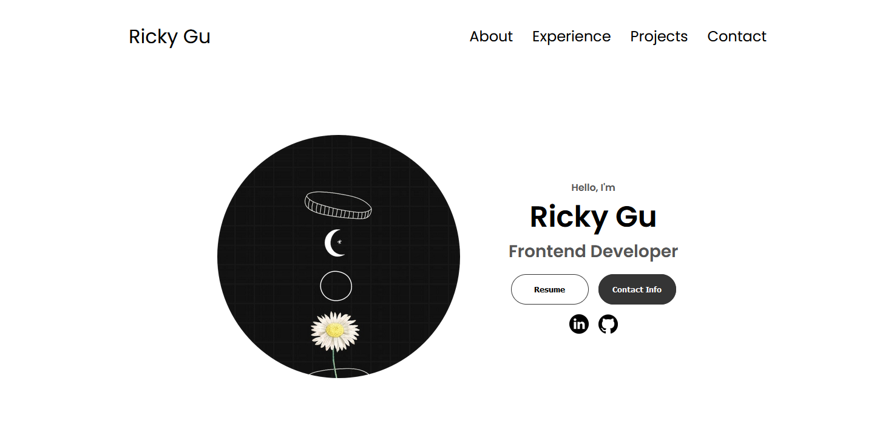

<h1 align="center" id="title">My Portfolio Website</h1>

<h2>🚀 Demo</h2>

[https://meet-ricky.netlify.app/](https://meet-ricky.netlify.app/)

<h2>Project Screenshots:</h2>

  
  
<h2>🧐 Features</h2>

Here're some of the project's best features:

*   Simple HTML and CSS
*   Responsive Design
